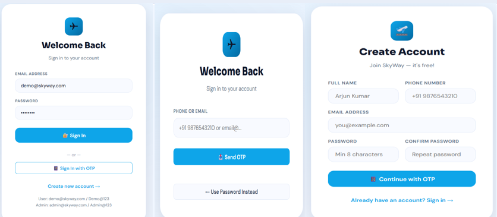
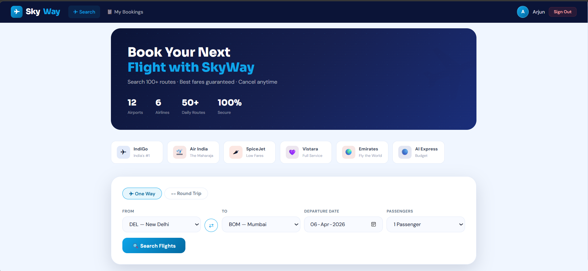
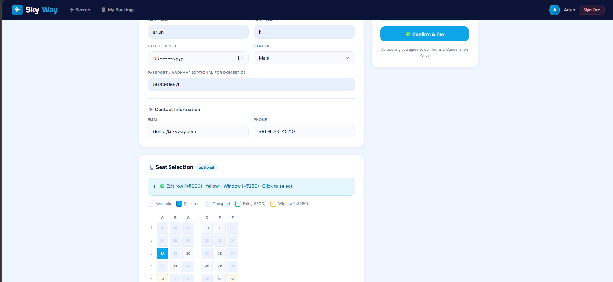
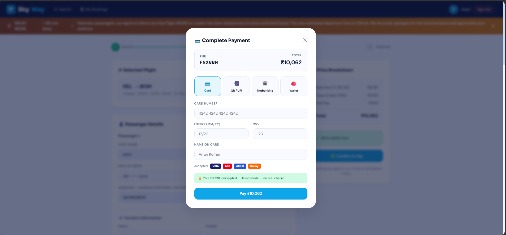
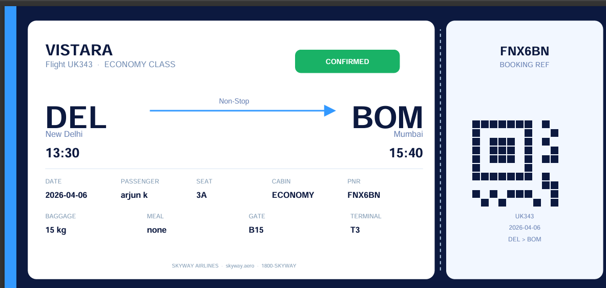
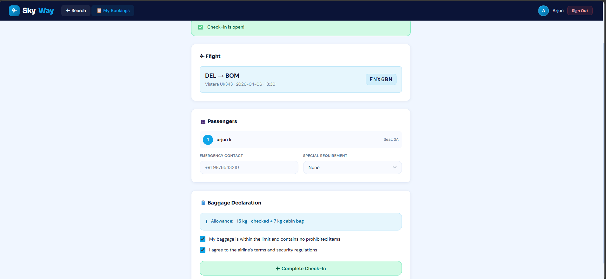
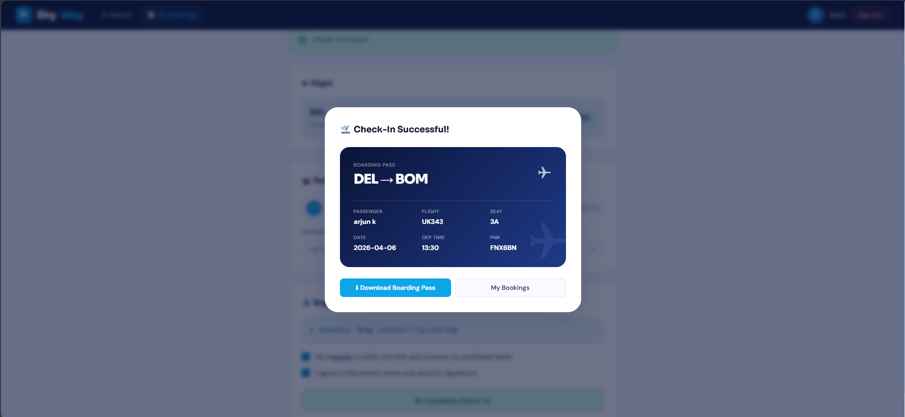
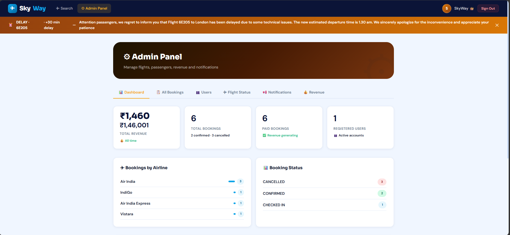
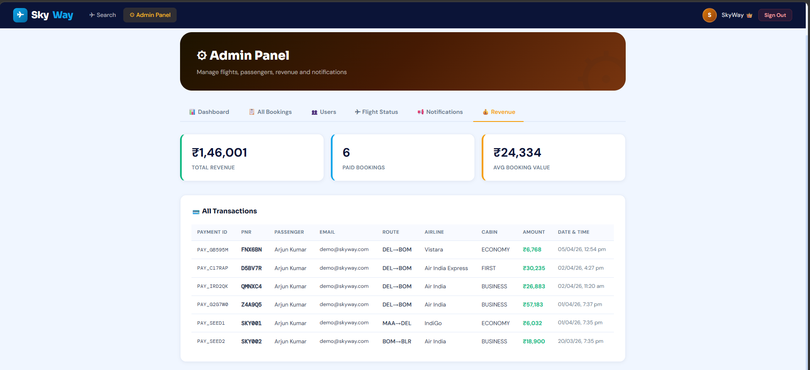
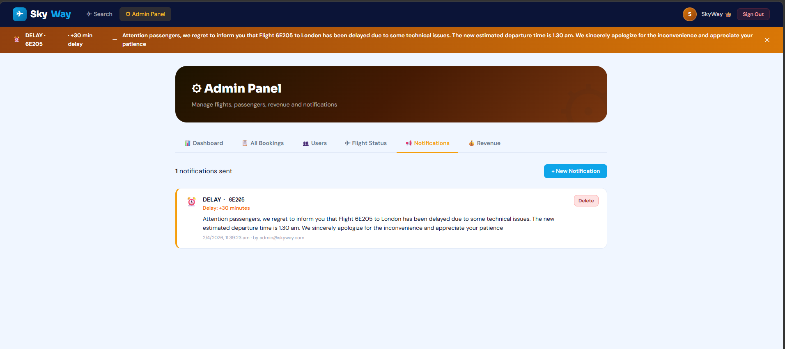

# SkyWay ✈️ — Flight Booking System

A full-featured flight booking web application built as part of an **AI-Assisted Coding course** using GitHub Copilot. Prompts were used to generate and refine code within VS Code.

> 🤖 **Note:** This project was developed using AI-assisted coding (GitHub Copilot) as a course exercise in prompt engineering and AI-driven development.

---

## 🔗 Demo Credentials

| Role | Email | Password |
|---|---|---|
| User | demo@skyway.com | demo123 |
| Admin | admin@skyway.com | admin123 |

---
## 📸 Screenshots
### Login and Singup Screens


### Home — Flight Search


### Seat Selection

### Payment

### Download ticket

### Check In and Boarding pass


### Admin Dashboard


### Admin Revenue


### Admin Notifications


---
## ✨ Features

**User Features**
- Flight search — one-way and round trips across 12 Indian & international airports
- Cabin selection — Economy, Business, First Class
- Seat selection with interactive seat map
- Meal and special service add-ons
- Online web check-in with boarding pass generation
- Booking management — view, cancel, reschedule
- OTP-based login and registration
- User profile management

**Admin Features**
- Admin dashboard with revenue stats
- View and manage all bookings
- Flight status updates (delay, cancellation, gate change)
- Push notifications to passengers
- Revenue reports and transaction history

---

## 🛠️ Tech Stack

- **Frontend** — HTML, CSS, Vanilla JavaScript
- **Backend** — Python (Flask)
- **Database** — JSON (db.json : file-based storage)

---

## 📁 Project Structure

```
SkyWay-Flight-Booking/
├── index.html       # Entry point — loads UI shell and mounts the app
├── app.js           # Frontend logic (routing, UI, API calls)
├── style.css        # Full stylesheet (responsive dark/light UI)
├── app.py           # Flask backend (REST API endpoints)
├── db.json          # JSON database (users, bookings, flights)
└── README.md
```

---

## ▶️ How to Run

```bash
# Install Flask
pip install flask

# Run the backend
python app.py
```

Then open link in your browser.

---

## 🌐 Airports Supported

Delhi · Mumbai · Chennai · Bengaluru · Kolkata · Hyderabad · Kochi · Pune · Dubai · Singapore · London · New York

---

## 💡 Key Learnings

- Prompt engineering for code generation using GitHub Copilot
- Building full-stack apps with Flask + Vanilla JS
- REST API design and JSON based data management
- Role-based access control (user vs admin)
- Session management and OTP authentication flow

---

*Author: Meher Naaz*

